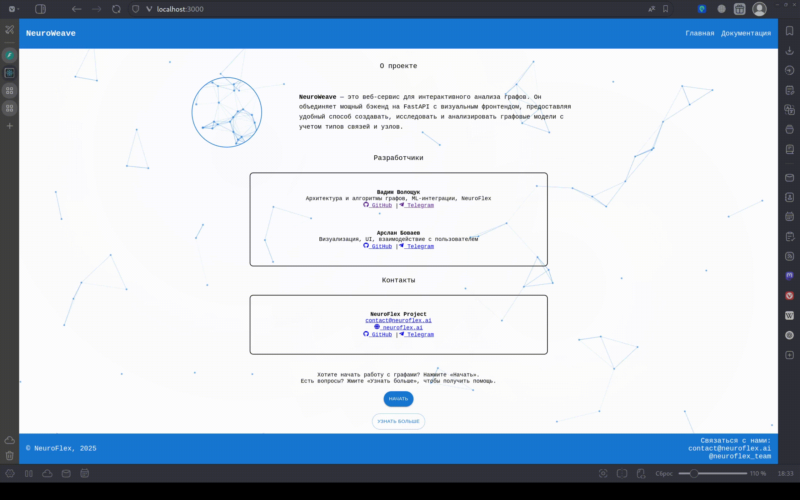

# NeuroWeave

**NeuroWeave** — это веб-приложение, которое позволяет работать с графами: создавать их, анализировать и визуализировать. На фронтенде используется **React**, а на бэкенде **FastAPI**. Все операции с графами выполняются в браузере, что делает процесс удобным и быстрым.




## 🚀 Основные возможности

| Возможность                              | Описание                                                                                                                                           |
|------------------------------------------|---------------------------------------------------------------------------------------------------------------------------------------------------|
| **Создание и редактирование графов**     | Добавление и удаление узлов и рёбер, настройка типов (ориентированные/неориентированные) и веса связей.                                             |
| **Анализ графов**                        | Вычисление кратчайших путей (алгоритм Дейкстры), матрицы кратчайших расстояний (Флойд—Уоршелл), кластеризации, метрик центральности.                  |
| **Кластеризация**                        | Реализация алгоритмов Spectral Clustering, K-Means, DBSCAN для кластеризации графов.                                                                |
| **Визуализация**                         | Визуализация графов с выделением путей, кластеров и типов рёбер с использованием **vis.js**.                                                        |

## 🧠 Что под капотом?

### 1. **Фронтенд** (React + vis.js) 🚀

**vis.js** — это библиотека для визуализации графов, которая используется для отрисовки и взаимодействия с графами в приложении. Она поддерживает динамическую визуализацию и предоставляет множество настроек для кастомизации внешнего вида графов.

- **Визуализация графов с vis.js**: Визуализация данных графа происходит с помощью компонента **Network** из библиотеки **vis.js**. Мы отображаем узлы и рёбра, где:
  - Узлы могут быть перемещаемыми.
  - Рёбра могут быть как направленными, так и ненаправленными.
  - Для рёбер можно настраивать толщину, цвет и метки, например, для отображения веса.
  - Возможность выделять узлы и рёбра на основе пользовательских операций.
  
- **Компоненты интерфейса**: Создание и редактирование графов происходит через интерфейс на **React**, который взаимодействует с визуализацией, предоставляя пользователю простой и интуитивно понятный способ работать с графами.
  
- **Динамическая перерисовка**: После вычислений на бэкенде, например, для поиска кратчайших путей или кластеризации, граф автоматически обновляется и визуализируется с новыми данными.

### 2. **Бэкенд** (FastAPI) 🖥️

- **FastAPI** принимает данные в формате JSON, выполняет необходимые вычисления и возвращает результаты.
- Реализованы алгоритмы Дейкстры, Флойд—Уоршелл, а также кластеризация и вычисление центральности.

## 🌍 Запуск проекта

### Бэкенд (FastAPI):

1. Установите зависимости:
   ```bash
   pip install -r requirements.txt
   ```
2. Запустите сервер:
   ```bash
   uvicorn backend.main:app --reload
   ```

### Фронтенд (React + vis.js):

1. Перейдите в директорию `frontend`.
2. Установите зависимости:
   ```bash
   npm install
   ```
3. Запустите приложение:
   ```bash
   npm start
   ```

## ⚙️ Архитектура взаимодействия

1. **Пользователь** создает или загружает граф в веб-приложении.
2. **React** отправляет запросы на **FastAPI** для выполнения вычислений.
3. **FastAPI** обрабатывает запрос и возвращает результат.
4. **React** обновляет визуализацию графа с новыми данными, используя **vis.js**.

## 🧮 Алгоритмы и вычисления

### Алгоритмы:

- **Дейкстра** (для нахождения кратчайшего пути).
- **Флойд—Уоршелл** (для вычисления всех кратчайших путей).
- **Кластеризация**:
  - **Spectral Clustering**
  - **K-Means**
  - **DBSCAN**
  
### Метрики графа:

- **Радиус** — минимальный эксцентриситет среди всех вершин.
- **Диаметр** — максимальный эксцентриситет.
- **Центр** — вершины, у которых эксцентриситет равен радиусу.

## 🌐 Как работает визуализация в **vis.js**?

- **Граф** строится с помощью **vis.Network**, который представляет собой элемент для визуализации и взаимодействия с графом.
- **Ноды** и **рёбра** отображаются в 2D с возможностью их динамического изменения.
- **Интерактивность**: можно щелкать по узлам и рёбрам, перетаскивать их, а также изменять их внешний вид (например, при расчете кратчайших путей или кластеризации).
  
### Настройка рёбер:

- **Толщина рёбер** изменяется в зависимости от веса рёбер.
- **Цвет рёбер** зависит от типа связи и веса, чтобы улучшить восприятие и отображение информации.

### Пример рёбер с различными типами:

```javascript
edges = edges.map((edge, index) => {
    const weightsArray = edge.weights.split(',').map(Number);
    const isMultiple = weightsArray.length > 1;
    const edgeLabel = isMultiple ? `ge${index + 1}/v${index + 1}` : `ge${index + 1}/tp${edge.type.replace(/\D/g, '')}`;
    const edgeWidth = isMultiple ? 3 : 1;
    const edgeColor = isMultiple ? 'blue' : 'black';

    return {
        ...edge,
        label: edgeLabel,
        color: edgeColor,
        font: {
            align: 'horizontal',
            strokeWidth: 0,
            background: '#ffffffaa'
        },
        width: edgeWidth
    };
});
```

## 📌 Подробности по алгоритмам и функционалу 🧮

1. **Алгоритмы кратчайшего пути**:  
   - Алгоритм Дейкстры (исключает отрицательные веса).  
   - Алгоритм Флойда—Уоршелла (получаем расстояния между **всеми** парами вершин).  

2. **Параметры графа**:  
   - **Радиус** — минимальный эксцентриситет среди всех вершин.  
   - **Диаметр** — максимальный эксцентриситет.  
   - **Центр** — множество вершин, у которых эксцентриситет равен радиусу.  

3. **Кластеризация**:  
   - **Spectral** — метод на основе спектра матрицы смежности/лапласиана.  
   - **K-Means** — классический алгоритм разбивки на \(k\) кластеров.  
   - **DBSCAN** — метод плотностной кластеризации (не нужно заранее указывать \(k\)).  

4. **Визуализация**:  
   - Отрисовка вершин (можно «цеплять» мышкой).  
   - Отрисовка рёбер (ориентированные/неориентированные).  
   - Цветовые выделения для путей, кластеров, типов и т.д.

## 🚀 Возможные направления расширения

- **Дополнительные метрики**: PageRank, Eigenvector Centrality, Girth (кратчайший цикл).  
- **Более продвинутая визуализация**: Анимация при перестроении графа, подписи с дополнительной информацией.  
- **Авторизация и сохранение** графов в базе данных (если нужно).  
- **Docker** или прочая контейнеризация для упрощённого развертывания.

## 🚀 Roadmap

Следите за развитием проекта и нашими будущими планами: [Roadmap](https://link_to_roadmap.com)

## 📌 Заключение

**NeuroWeave** — это инструмент для создания, анализа и визуализации графов, который будет полезен как для учебных целей, так и для решения реальных задач в области анализа данных, социальных сетей, транспортных сетей и других приложений.